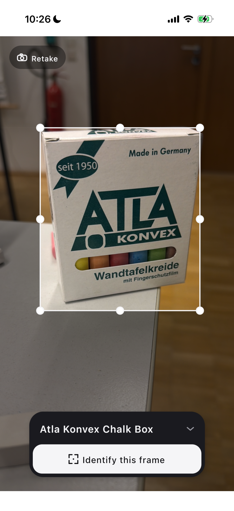
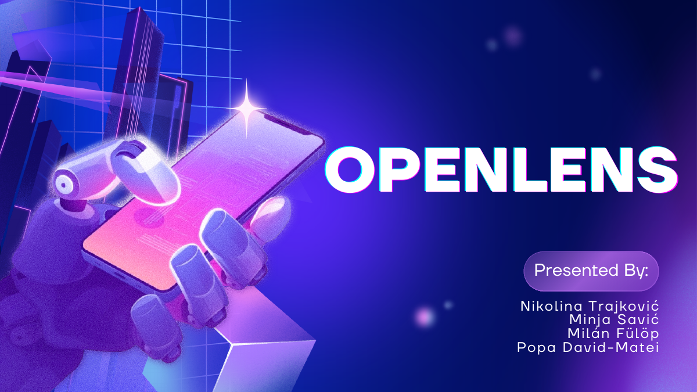

# OpenLens

**OpenLens** is an open-source, visual-search app in the spirit of Google Lens: point your camera at an object, and the app detects it, crops it, and describes it — then finds related content across the web.

It was built as an **educational project** during the [**ACTS 2026.2**](https://lp.jetbrains.com/academy/acts/2026.2/) SE Track by [**Milán Fülöp**](https://github.com/milanfulop), [**David-Matei Popa**](https://github.com/pht-poapa), [**Minja Savić**](https://github.com/minjasav92), and [**Nikolina Trajković**](https://github.com/nniiinnnaa), mentored by [**Alexander Kovrigin**](https://github.com/waleko), in Bremen, Germany (July 2026).

## Demo

<table>
  <tr>
    <td align="center" valign="middle">
      
       🎬 <a href="docs/assets/demo.mp4"><b>Watch the demo</b></a>
    </td>
    <td align="center" valign="middle">
      
       📊 <a href="https://canva.link/90dqa8mdykggjlt"><b>Presentation on Canva</b></a>
    </td>
  </tr>
</table>

## Features

- 📷 **Live camera capture** — Kotlin Multiplatform (Compose) app for **Android and iOS**.
- 🎯 **Automatic object detection** — YOLO finds the main object in frame and draws an adjustable bounding box.
- 🌫️ **Anti-blur** — rejects blurry frames so only sharp images reach the model.
- 👆 **Tap to identify** — focuses on the selected region and identifies it on demand.
- 🧠 **AI vision descriptions** — heading + factual description via `google/gemini-3-flash-preview` on OpenRouter.
- 🖥️ **Self-hosted VLM** — a self-hosted vision-language model for free inference alongside external providers.
- 🔎 **Related content search** — surfaces similar images and cited web sources for the detected object.
- 🎟️ **User credits system** — per-user credit accounting for model calls.
- ⚙️ **FastAPI backend** — image analysis, detection, related search, and token-based auth.

## Architecture

- **`app/`** — Kotlin Multiplatform client (Compose UI, Android + iOS).
- **`server/`** — FastAPI backend (detection, cropping, model calls, related search, auth).
- **`Model/`** — prompt engineering and model-evaluation results.
- **`BoundingBox/`** — object-detection experiments.
